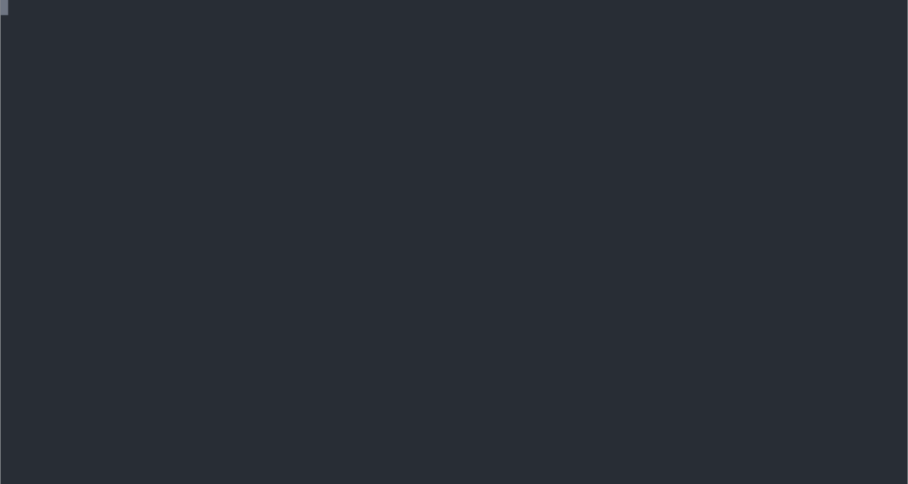

# go-typosquatting

Need to typosquat a domain name? Define the domain name to be spoofed and choose your strategies (they are not combined but executed on your base domain name).

The program takes care of making the changes and returns the available domain names.

Example:




## How to use it

### Installing

Make sure that Go is installed on your computer.
```sh
git clone https://github.com/Bilou4/go-typosquatting.git
go mod tidy
go build
# You are ready to Go.
```

## Related projects

Special thanks to the authors of these github repositories.
* https://github.com/jedib0t/go-pretty
* https://github.com/asaskevich/govalidator
* https://github.com/codebox/homoglyph/
* https://github.com/gosuri/uiprogress

For the Top Level Domain list.
* http://data.iana.org/TLD/tlds-alpha-by-domain.txt

For the video example.
* https://github.com/marionebl/svg-term-cli
* https://asciinema.org/